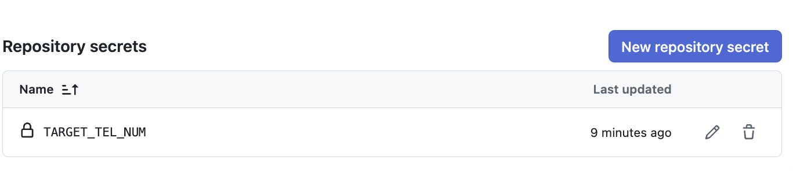

# SMS Trick

> 短信恶作剧, 短信, 轰炸, 恶作剧.

这是一个用于自动化发送短信验证码的项目，适用于测试、娱乐或“问候”特定手机号。

**免责声明：本项目仅供学习与娱乐用途，请勿用于非法用途。**

---

## Main Features

- 支持十余个主流网站的验证码短信自动发送 (持续增加)
- 一键批量触发多站点短信接口
- Playwright 自动化测试脚本，易于扩展
- 环境变量配置，支持自定义目标手机号
- GitHub Actions 无人值守无限运行

---

## 使用方法

### 1. 配置手机号

创建一个 `.env` 文件，写入你的目标手机号：

```
TARGET_TEL_NUM=13XXXXXXXXX
```

### 2. 安装依赖

```
npm i
npx playwright install chromium
```

### 3. 运行测试

#### 只运行一个用例

将 `.env` 中手机号改为你自己的，运行如下命令：

```
npx playwright test tests/chromium.spec.js -g "百度"
```

#### 运行全部用例

```
npx playwright test
```

---

## GitHub Actions 自动化

1. 在仓库设置 Secrets，添加你的手机号等敏感信息
2. 触发 Actions 工作流即可自动批量发送



---

## 免责声明

本项目仅供娱乐和测试用途，严禁用于骚扰、诈骗等违法行为。由此产生的任何后果与作者无关。
